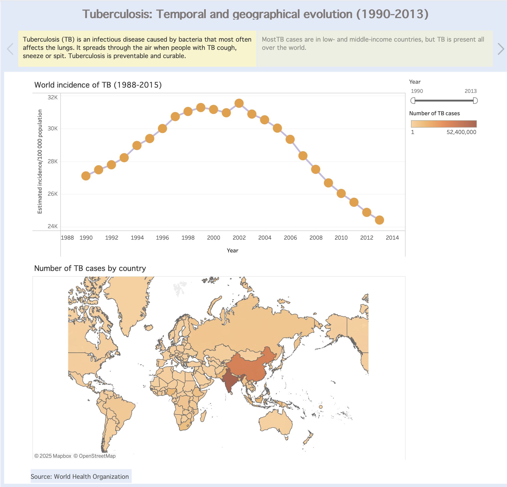

# Tuberculosis: Temporal and geographical evolution

### Project summary ###

This project explores the temporal and geographical evolution of tuberculosis (TB) from 1990 to 2013, using data from the [World Health Organization (WHO)](https://www.who.int/teams/global-tuberculosis-programme/data) repository.
Interactive Tableau visualizations enable exploration at global, regional, and country levels with a particular focus on three indicators: TB incidence, TB deaths, and TB + HIV coinfection.

### Why this period

The 1990–2013 window captures important global public-health transitions: the post-Cold War era of renewed international health initiatives, the scale-up of antiretroviral therapy for HIV in the 2000s (which affected TB dynamics), and the period leading up to the Sustainable Development Goals. Analyzing this period helps reveal how TB burden responded to evolving health systems, treatment access, and the HIV epidemic.

### Data overview

- **Indicators included:** TB incidence (new and relapse cases per year), TB-attributed deaths, and TB cases among people living with HIV (coinfection).

- **Temporal coverage:** annual data from 1990 through 2013.

- **Geographical coverage:** global — countries grouped into WHO regions and income categories for comparative views.

### Visualizations (Tableau)

The Tableau workbook contains dashboards tailored to analyze:

- **Global trends** — line charts showing global and regional trends for incidence and deaths (1990–2013).

- **Geographical heatmap** — choropleth map (by year) that visualize incidence at country level.

- **TB + HIV dashboard** — combined view showing spatial concentration of TB+HIV cases and trend lines for regions most affected by coinfection.

- **Country comparison** — rank lists to compare countries’ TB deaths.

### Key findings

- **Global decline in rates**: Over the 1990–2013 period the curve shows a gradual decline in TB incidence rate, reflecting improvements in diagnosis, treatment, and control programs.

- **Regional heterogeneity**: The global picture conceals marked regional differences. High-burden areas (notably parts of sub‑Saharan Africa and South‑East Asia) persistently carried a disproportionate share of incidence and deaths.

- **Impact of HIV**: TB + HIV coinfection substantially increased TB burden in regions with high TB prevalence, and coinfection trends are a major driver of mortality patterns in some African countries.

### Next steps

- Extend the time window beyond 2013 to include more recent trends.

- Add age- and sex-disaggregated analysis if granular data are available.

- Incorporate covariates (HIV prevalence, GDP per capita, health expenditure) to model drivers of change.

### Interactive Visualizations
Explore the full interactive dashboards here: [Global Tuberculosis in Tableau Public] (https://public.tableau.com/app/profile/valeria.burgos/viz/Tuberculosistemporalandgeographicalevolution/Story2)

